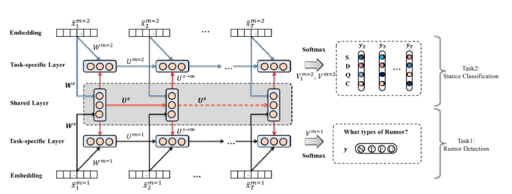

# Battling-the-Bots
Building tools for defending the information ecosystem in the disinformation war.

- **Surveys**
    1. [Combating Fake News: A Survey on Identification and Mitigation Techniques](https://arxiv.org/pdf/1901.06437.pdf)
        K.Sharma, F.Qian, H.Jiang, N.Ruchansky, and Y.Liu. 2019.
    1. [Detection and resolution of rumours in social media: A survey]()
        Arkaitz Zubiaga, Maria Liakata, Rob Procter, Geraldine Wong Sak Hoi, and Peter Tolmie. 2018.
    1. [Fake News Early Detection: A Theory-driven Model](https://arxiv.org/pdf/1904.11679v1.pdf)
        Xinyi Zhou, Atishay Jain, Vir V. Phoha and Reza Zafarani. 2019.
    1. [Fake News Detection on Social Media: A Data Mining Perspective](https://arxiv.org/pdf/1708.01967.pdf)
    1. [False information on web and social media: A survey](https://arxiv.org/pdf/1804.08559.pdf)
        Srijan Kumar and Neil Shah. 2018. 
    1. [A Retrospective Analysis of the Fake News Challenge Stance Detection Task](https://www.aclweb.org/anthology/C18-1158) Andreas Hanselowski, Avinesh PVS, Benjamin Schiller, Felix Caspelherr, Debanjan Chaudhuri, Christian M. Meyer, Iryna Gurevych. 2018.
    1. [The Spread of True and False News Online](http://ide.mit.edu/sites/default/files/publications/2017%20IDE%20Research%20Brief%20False%20News.pdf)
        Soroush Vosoughi, Deb Roy, and Sinan Aral. 2018.
        [Supplementary Materials](http://science.sciencemag.org/highwire/filestream/706928/field_highwire_adjunct_files/0/aap9559_Vosoughi_SM.pdf)
    1. [A Survey on Natural Language Processing for Fake News Detection](https://arxiv.org/abs/1811.00770)
        Ray Oshikawa, Jing Qian, William Yang Wang. 2018.
        *A systematic review of the datasets and NLP solutions that have been developed for fake news detection.* 
    2. [Studying Fake News via Network Analysis: Detection and Mitigation](https://arxiv.org/abs/1804.10233)
        Kai Shu, H. Russell Bernard, and Huan Liu. 2018.

- **Tutorials**
    1. [Building a Fake News Detector](http://www.paulvangent.com/2018/08/31/building-a-fake-news-detector/)
    1. [Comprehensive Data Exploration with Python](https://www.kaggle.com/pmarcelino/comprehensive-data-exploration-with-python)
    1. [Detecting Fake News with Scikit-Learn](https://www.datacamp.com/community/tutorials/scikit-learn-fake-news)
    1. [Fake News Detection](https://github.com/nishitpatel01/Fake_News_Detection)
        *A demonstration of various natural language processing techniques and machine learning algorithms to classifty fake news articles using sci-kit libraries from python.*
    1. [Fake News: Fundamental Theories, Detection Strategies and Challenges](https://www.fake-news-tutorial.com/)           **Paper**: [Fake News: Fundamental Theories, Detection Strategies and Challenges](http://www.public.asu.edu/~skai2/papers/wsdm_fake_news_tutorial.pdf)
        Xinyi Zhou, Reza Zafarani, Kai Shu, and Huan Liu. 2019.
    1. [How to Analyze Twitter Data with MAXQDA: 2018 US Midterm Election Tweets](MAXQDA)
    2. [Lesson on Twitter Social Network Analysis](https://github.com/alexbovet/network_lesson)

- **Datasets**
    1. [FEVER 2.0 Shared Task](http://fever.ai/task.html)
        *The FEVER 2.0 Shared Task will build upon work from the first shared task in a Build it Break it Fix it setting. The shared will comprise three phases. In the first phase of the shared task, Builders build systems for solving the first FEVER shared task dataset. The highest scoring systems from the first shared task will be used as baselines and we will also invite new participants to develop new systems.*
    1. [BuzzFeed](https://github.com/BuzzFeedNews/2016-10-facebook-fact-check)
       **Article**: [Hyperpartisan Facebook Pages Are Publishing False And Misleading Information At An Alarming Rate](https://www.buzzfeed.com/craigsilverman/partisan-fb-pages-analysis)
        Craig Silverman, Lauren Strapagiel, Hamza Shaban, Ellie Hall and Jeremy Singer-Vine. 2016.
    1. [FakeNewsChallenge](http://www.fakenewschallenge.org/)
        *The goal of the Fake News Challenge is to explore how artificial intelligence technologies, particularly machine learning and natural language processing, might be leveraged to combat the fake news problem. We believe that these AI technologies hold promise for significantly automating parts of the procedure human fact checkers use today to determine if a story is real or a hoax.*
    1. [Factuality and Bias Prediction of News Sources](https://github.com/ramybaly/News-Media-Reliability)
        **Paper**: [Predicting Factuality of Reporting and Bias of News Media Sources](https://arxiv.org/pdf/1810.01765.pdf)
        Ramy Baly, Georgi Karadzhov, Dimitar Alexandrov, James Glass and Preslav Nakov. 2018.
    2. [Fake-News-Corpus](https://github.com/abhinavchdhry/Fake-News-Corpus)
    3. [FakeNewsNet](https://github.com/KaiDMML/FakeNewsNet): A Data Repository with News Content, Social Context and Dynamic Information for Studying Fake News on Social Media
    3. [Kaggle: Getting Real about Fake News](https://www.kaggle.com/mrisdal/fake-news)
    3. [Kaggle: Fake News](https://www.kaggle.com/c/fake-news/)
    4. [LIAR Dataset](https://www.cs.ucsb.edu/~william/data/liar_dataset.zip)
        **Paper**: [Liar, Liar Pants on Fire: A New Benchmark Dataset for Fake News Detection](https://arxiv.org/pdf/1705.00648v1.pdf)
        William Yang Wang. 2017.
    4. [Speaker2Credit](https://github.com/akthesis/speaker2credit)
        *Speaker2Credit is based on the publicly available data from PolitiFact.com and the benchmark data set LIAR (Wang 2017). Given a speaker's name, job title, party affiliation and home state one can look up their corresponding credibility vector.*
        **Paper**:[Exploiting a Speaker’s Credibility to Detect Fake News](https://drive.google.com/file/d/1zEbxEfMfZn-2frsU2bVScvZM8dsDS3hZ/view)
        Kirilin, Angelika  and  Strube, Micheal. 2018
    5. [Twitter. Detecting Rumors from Microblogs with Recurrent Neural Networks](http://alt.qcri.org/~wgao/data/rumdect.zip)
         **Paper**: [Detecting Rumors from Microblogs with Recurrent Neural Networks](https://www.ijcai.org/Proceedings/16/Papers/537.pdf)
        Jing Ma, Wei Gao, Prasenjit Mitra, Sejeong Kwon, Bernard J Jansen, Kam-Fai Wong, and Meeyoung Cha. 2016.

- **Resources**
    1. [Blue Feed, Red Feed](http://graphics.wsj.com/blue-feed-red-feed/#/guns)
        *The Wall Street Journal presents Liberal Facebook and Conservative Facebook, Side by Side.*
        **Dataset**: [blue-feed-red-feed-sources](https://github.com/jonkeegan/blue-feed-red-feed-sources)
        **Paper**: [Replication Data for: Exposure to Ideologically Diverse News and Opinion on Facebook](http://dx.doi.org/10.7910/DVN/LDJ7MS)
        Eytan Bakshy, Solomon Messing; Lada Adamic. 2015.
    1. [bs-detector](https://gitlab.com/bs-detector/bs-detector)
        *A browser extension that alerts users to unreliable news sources.*
    1. [Channel 4 News FactCheck](https://www.channel4.com/news/factcheck/)
    1. [electome](http://electome.org/)
    1. [FakeNewsTracker](http://blogtrackers.fulton.asu.edu:3000/#/dashboard)
    1. [False, Misleading, Clickbait-y, and Satirical “News” Sources](https://d279m997dpfwgl.cloudfront.net/wp/2016/11/Resource-False-Misleading-Clickbait-y-and-Satirical-%E2%80%9CNews%E2%80%9D-Sources-1.pdf)
        Melissa Zimdars. 2016.
    1. [Fiskkit](https://fiskkit.com/)
        *A platform for civil, fact-based, and engaging discussions*
    1. [FullFact](https://fullfact.org/)
        Full Fact is the UK’s independent factchecking charity
    1. [The Internet of tomorrow: Privacy, Accountability, Compliance and Trust](https://www.mpi-inf.mpg.de/departments/databases-and-information-systems/research/impact/)
    1. [NELA Tookkit](http://nelatoolkit.science/)
        The News Landscape (NELA) Toolkit is an open source toolkit for the systematic exploration of the news landscape. 
    1. [Open Sources](http://www.opensources.co/)
        Professionally curated lists of online sources, available free for public use.
    1. [PolitiFact](https://www.politifact.com/)
        *Fact-checking journalism is the heart of PolitiFact. Our core principles are independence, transparency, fairness, thorough reporting and clear writing. The reason we publish is to give citizens the information they need to govern themselves in a democracy.*
    2. [Snopes](https://www.snopes.com/)
        *When misinformation obscures the truth and readers don’t know what to trust, Snopes.com’s fact checking and original, investigative reporting lights the way to evidence-based and contextualized analysis. We always document our sources so readers are empowered to do independent research and make up their own minds.*
    3. [TextThresher](https://bids.berkeley.edu/research/text-thresher)
        *Text Thresher improves the social science practice of content analysis, making it vastly more transparent and scalable to hundreds of thousands of documents. Text Thresher is a web-interface operating in citizen science and crowd working environments like CrowdCrafting. The interface allows researchers to clearly specify hand-labeling and text classification tasks in a user-friendly workflow that maximizes crowd worker accuracy and efficiency. As citizen scientists or crowd workers label and extract data from thousands of documents using Text Thresher, they simultaneously generate training sets enabling machine learning algorithms to augment or replace researchers' and crowd workers' efforts. Output is ready for a range of computational text analysis techniques and viewable as labels layered over original document text. Text Thresher is free and open source and will be ready for use by the broader research community in the late 2017.*

- **Short Articles/Blog Posts/Project Reports/Repos**
    1. [The Breaking News Consumer's Handbook](https://www.wnyc.org/story/breaking-news-consumers-handbook-pdf/)
    1. [DHSF](https://github.com/hamidkarimi/DHSF)
        **Paper**: [Learning Hierarchical Discourse-level Structure for Fake News Detection](http://cse.msu.edu/~karimiha/publications/NAACL2019Discourse.pdf)
        Hamid Karimi and Jiliang Tang. 2019.
    1. [Features of Lies](https://paul92.github.io/ADA_Project/)
    2. [How to tell fake news from real news](https://blog.ed.ted.com/2017/01/12/how-to-tell-fake-news-from-real-news/)
         Laura McClure. 2017
    2. [Lies have short legs?](https://exploringlies.github.io/lies-have-short-legs/)
    3. [We Gave You 3 Million Russian Troll Tweets. Here’s What You’ve Found So Far](https://fivethirtyeight.com/features/what-you-found-in-3-million-russian-troll-tweets/)

- **Research Papers**
    1. [Acquiring Background Knowledge to Improve Moral Value Prediction]()
        Ying Lin, Joe Hoover†, Gwenyth Portillo-Wightman, Christina Park, Morteza Dehghani and Heng Ji
        **Code**: [Moral Value Prediction](https://github.com/limteng-rpi/mvp)
    1. [Assessing the News Landscape: A Multi-Module Toolkit for Evaluating the Credibility of News](http://homepages.rpi.edu/~horneb/WWW18_Horne_Demo.pdf)
    1. [Explaining opinion polarisation with opinion copulas](https://journals.plos.org/plosone/article/file?id=10.1371/journal.pone.0183277&type=printable)
        Nikolaos Askitas. 2017.
    1. [Influence of fake news in Twitter during the 2016 US presidential election](http://www.nature.com/articles/s41467-018-07761-2)
        A. Bovet and H. A. Makse. 2019
        **Code**:[Information-Diffusion](https://github.com/alexbovet/information_diffusion)
    3. [Modeling confirmation bias and polarization](https://arxiv.org/pdf/1607.00022.pdf)
        Michela Del Vicario, Antonio Scala, Guido Caldarelli, H. Eugene Stanley and Walter Quattrociocchi. 2016.
    4. [Predicting Factuality of Reporting and Bias of News Media Sources](https://arxiv.org/pdf/1810.01765.pdf)
    Ramy Baly, Georgi Karadzhov, Dimitar Alexandrov, James Glass, Preslav Nakov. 2018
    **Code**: [News-Media-Reliability](https://github.com/ramybaly/News-Media-Reliability)

## Other Resources
1. [Acquiring Background Knowledge to Improve Moral Value Prediction]()
    Ying Lin, Joe Hoover†, Gwenyth Portillo-Wightman, Christina Park, Morteza Dehghani and Heng Ji
    **Code**: [Moral Value Prediction](https://github.com/limteng-rpi/mvp)

1. [Battling the Bots](https://foreignpolicy.com/2018/11/12/battling-the-bots-ai-russia-disinformation-fake-news/)
2. [Disinformation Warfare: Understanding State-Sponsored Trolls on Twitter and Their Influence on the Web](https://arxiv.org/pdf/1801.09288.pdf)
3. [Democrats ‘went low’ on Twitter leading up to 2018](https://www.rollcall.com/news/campaigns/lead-midterms-twitter-republicans-went-high-democrats-went-low)

3. [Getting Real about Fake News](https://www.kaggle.com/mrisdal/fake-news)
3. [How Google Fights Disinformation](https://storage.googleapis.com/gweb-uniblog-publish-prod/documents/HowGoogleFightsDisinformation.pdf?utm_campaign=NLP%20News&utm_medium=email&utm_source=Revue%20newsletter)
3. [Influence of fake news in Twitter during the 2016 US presidential election](https://www.researchgate.net/publication/323956688_Influence_of_fake_news_in_Twitter_during_the_2016_US_presidential_election)
    Alexandre Bovet and Hernán A. Makse. 2019.
3. [Information Disorder: Toward an interdisciplinary framework for research and policymaking](https://shorensteincenter.org/wp-content/uploads/2017/10/PREMS-162317-GBR-2018-Report-de%CC%81sinformation.pdf?x78124)
    Claire Wardle and Hossein Derakhshan with research support from Anne Burns and Nic Dias. September 27, 2017
3. [International Fact-Checking Network](https://www.poynter.org/ifcn/)
3. [The Fight Against Disinformation in the U.S.: A Landscape Analysis](https://shorensteincenter.org/the-fight-against-disinformation-in-the-u-s-a-landscape-analysis/)
 Heidi Legg and Joe Kerwin. 2018.
4. [GetOldTweets-python](https://github.com/Jefferson-Henrique/GetOldTweets-python)

4. [Predicting Factuality of Reporting and Bias of News Media Sources](https://arxiv.org/pdf/1810.01765.pdf)
    Ramy Baly, Georgi Karadzhov, Dimitar Alexandrov, James Glass, Preslav Nakov. 2018
    **Code**: [News-Media-Reliability](https://github.com/ramybaly/News-Media-Reliability)
4. [These projects are using AI to fight misinformation](https://www.poynter.org/fact-checking/2019/these-projects-are-using-ai-to-fight-misinformation/)
4. [The science of fake news](http://science.sciencemag.org/content/359/6380/1094)
     David Lazer, Matthew Baum, Yochai Benkler, Adam Berinsky, Kelly Greenhill, Filippo Menczer, Miriam Metzger, Brendan Nyhan, Gordon Pennycook, David Rothschild, Michael Schudson, Steven Sloman, Cass Sunstein, Emily Thorson, Duncan Watts, Jonathan Zittrain
4. [Shorenstein Center Misinformation Project](https://shorensteincenter.org/about-us/areas-of-focus/misinformation/)
4. [The spread of true and false news online](http://ide.mit.edu/sites/default/files/publications/2017%20IDE%20Research%20Brief%20False%20News.pdf)
    Soroush Vosoughi, Deb Roy, and Sinan Aral. 2017.
    **Supplementary Materials**:[The spread of true and false news online](http://science.sciencemag.org/content/sci/suppl/2018/03/07/359.6380.1146.DC1/aap9559_Vosoughi_SM.pdf)

5. [Tackling Domestic Disinformation](https://issuu.com/nyusterncenterforbusinessandhumanri/docs/nyu_domestic_disinformation_digital?e=31640827/68184927)
 PAUL M. BARRETT

